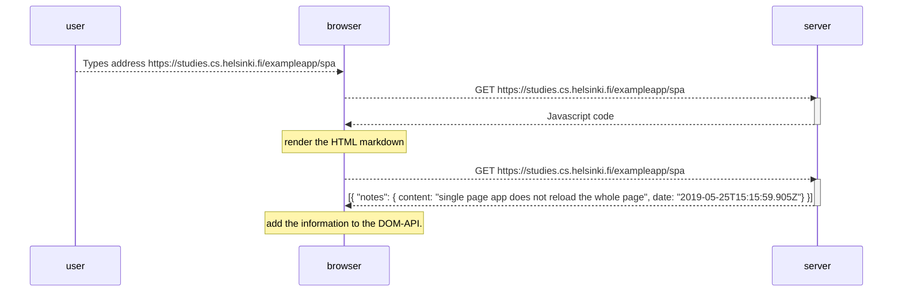

```mermaid
    sequenceDiagram
        participant user
        participant browser
        participant server

        user-->>browser: Types address https://studies.cs.helsinki.fi/exampleapp/spa
        browser-->>server: GET https://studies.cs.helsinki.fi/exampleapp/spa
        activate server
        server-->>browser: Javascript code
        deactivate server
        Note over browser: render the HTML markdown
        
        browser-->>server: GET https://studies.cs.helsinki.fi/exampleapp/spa
        activate server
        server-->>browser: [{ "notes": { content: "single page app does not reload the whole page", date: "2019-05-25T15:15:59.905Z"} }]
        deactivate server
        Note over browser: add the information to the DOM-API.

```