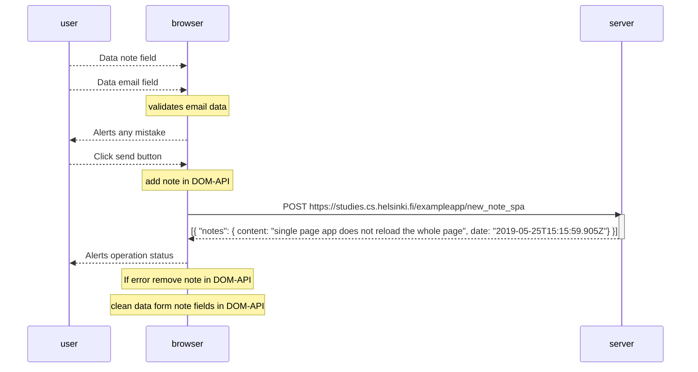

```mermaid
    sequenceDiagram
        participant user
        participant browser
        participant server

        user-->>browser: Data note field
        user-->>browser: Data email field
        Note over browser: validates email data 
        browser-->>user: Alerts any mistake
        user-->>browser: Click send button
        Note over browser: add note in DOM-API

        browser->>server: POST https://studies.cs.helsinki.fi/exampleapp/new_note_spa
        activate server
        server-->>browser: [{ "notes": { content: "single page app does not reload the whole page", date: "2019-05-25T15:15:59.905Z"} }]
        deactivate server

        browser-->>user: Alerts operation status
        Note over browser: If error remove note in DOM-API
        Note over browser: clean data form note fields in DOM-API
```